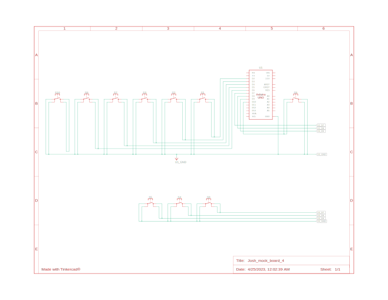

### Diagram

> More details about the **Input Sources**, **Input System**, and **State Machine** are available via [Terminology](https://github.com/andrewsng/assistive-technology/wiki/Terminology) section.

### Typing State

### Command / Confirmation State

### Punctuation State

### Arduino Schematic

